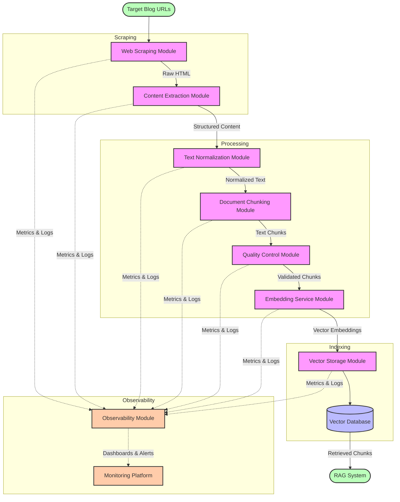

# Web Scraping and RAG System Project Requirements Document

## 1. Executive Summary

This document outlines the requirements for developing a robust and scalable pipeline for web scraping blog content, processing the extracted data, and preparing it for use in a Retrieval-Augmented Generation (RAG) system. The project aims to create a local knowledge base of thousands of blog posts that can be efficiently queried for relevant information. The system will be designed with modularity in mind, allowing components to be swapped or upgraded as needed.

## 2. Project Objectives

- Develop a high-performance web scraping system capable of extracting content from thousands of blog posts
- Create an efficient pipeline for cleaning, processing, and structuring the extracted content
- Implement robust content chunking strategies to optimize for retrieval performance
- Build a quality control system to ensure data integrity and handle edge cases
- Design a modular architecture that allows for component substitution and system evolution

## 3. System Architecture

The system will follow a modular architecture with the following components:

### 3.1 Web Scraping Module

**Responsibilities:**
- Discovering and crawling blog URLs
- Fetching HTML content with appropriate handling of JavaScript-rendered pages
- Respecting robots.txt and implementing ethical scraping practices
- Managing rate limiting and error handling
- Supporting both static and dynamic content scraping

**Interface Requirements:**
- Input: Configuration settings including target URLs, scraping parameters
- Output: Raw HTML content and associated metadata (URL, timestamp, HTTP status)
- Configuration Options: Rate limits, concurrency levels, retry logic, user-agent settings

**Technical Specifications:**
- Implementation in Go using Colly for high-performance concurrent scraping
- Support for both lightweight HTTP requests and headless browser rendering
- Proxy rotation and user-agent cycling capabilities
- Robust error handling and logging

### 3.2 Content Extraction Module

**Responsibilities:**
- Separating main article content from boilerplate (headers, footers, navigation, ads)
- Preserving semantic structure (headings, paragraphs, lists)
- Extracting relevant metadata (title, author, publication date, categories)
- Optional handling of images for CLIP embedding

**Interface Requirements:**
- Input: Raw HTML content and source metadata
- Output: Structured content object containing cleaned text, preserved HTML structure, and metadata
- Configuration Options: Content extraction algorithm, structure preservation settings

**Technical Specifications:**
- Primary implementation using Readability-based algorithms (go-readability)
- Support for site-specific extraction rules when needed
- Optional image extraction and processing capabilities
- Metadata normalization and validation

### 3.3 Text Normalization Module

**Responsibilities:**
- Standardizing text formatting while preserving semantic information
- Handling encoding issues and special characters
- Preparing text for optimal embedding performance
- Preserving domain-specific terminology and meaningful formatting

**Interface Requirements:**
- Input: Extracted content object
- Output: Normalized content ready for chunking and embedding
- Configuration Options: Normalization level, character handling rules

**Technical Specifications:**
- UTF-8 encoding normalization
- Minimal text alteration to preserve semantic information
- Optional handling of typos, special characters, and formatting
- Support for different embedding model requirements

### 3.4 Document Chunking Module

**Responsibilities:**
- Splitting documents into appropriate-sized chunks for indexing
- Managing overlap between chunks when appropriate
- Respecting semantic boundaries where possible
- Attaching source metadata to each chunk

**Interface Requirements:**
- Input: Normalized content with metadata
- Output: Collection of chunks with attached metadata
- Configuration Options: Chunk size, overlap percentage, chunking strategy

**Technical Specifications:**
- Support for multiple chunking strategies (token-based, semantic, structural)
- Default settings based on research (200-500 tokens with appropriate overlap)
- Metadata propagation to ensure source tracking
- Performance optimization for large document processing

### 3.5 Quality Control Module

**Responsibilities:**
- Detecting and filtering low-quality or irrelevant content
- Identifying and managing duplicate or near-duplicate content
- Validating content integrity and structure
- Monitoring system performance and data quality

**Interface Requirements:**
- Input: Processed chunks and system logs
- Output: Quality reports, filtered content, system alerts
- Configuration Options: Quality thresholds, duplicate detection sensitivity

**Technical Specifications:**
- Content quality validation based on multiple heuristics
- Exact match and SimHash-based near-duplicate detection
- Anomaly detection for processing errors
- Comprehensive logging and reporting

### 3.6 Embedding Service Module

**Responsibilities:**
- Converting text chunks to vector embeddings
- Handling different embedding models and configurations
- Managing batch processing for efficiency
- Interfacing with vector storage systems

**Interface Requirements:**
- Input: Processed text chunks with metadata
- Output: Vector embeddings with associated metadata
- Configuration Options: Embedding model selection, dimensionality, batch size

**Technical Specifications:**
- Support for multiple embedding models (OpenAI, CLIP, SBERT, etc.)
- Efficient batch processing capabilities
- Model-specific preprocessing handlers
- Consistent vector output format regardless of underlying model

### 3.7 Vector Storage Module

**Responsibilities:**
- Storing and indexing vector embeddings
- Supporting efficient similarity search
- Managing metadata and retrieval
- Handling data persistence and updates

**Interface Requirements:**
- Input: Vector embeddings with metadata
- Output: Retrieval capabilities based on vector similarity
- Configuration Options: Database selection, index settings, performance parameters

**Technical Specifications:**
- Support for multiple vector databases (e.g., Chroma, FAISS, Pinecone)
- Local file-based storage option for independence from external services
- Efficient indexing for fast similarity search
- Metadata filtering capabilities

### 3.8 Observability Module

**Responsibilities:**
- Collecting comprehensive metrics across all system components
- Monitoring system health and performance in real-time
- Tracing the flow of data through the pipeline
- Alerting on anomalies or performance degradation
- Providing insights for system optimization

**Interface Requirements:**
- Input: Instrumentation hooks into all system components
- Output: Metrics dashboards, logs, traces, and alerts
- Configuration Options: Retention periods, sampling rates, alert thresholds

**Technical Specifications:**
- Structured logging with correlation IDs to track content through the pipeline
- Metrics collection for system throughput, latency, error rates, and resource utilization
- Distributed tracing to monitor the journey of each article through processing stages
- Real-time dashboards for key performance indicators
- Alerting based on predefined thresholds and anomaly detection
- Integration with common observability platforms (Prometheus, Grafana, Jaeger)
- Health check endpoints for each component to enable automated monitoring

## 4. Data Flow

The system will process data through the following pipeline:

1. The Web Scraping Module discovers and fetches content from target blogs
2. The Content Extraction Module processes raw HTML into clean, structured content
3. The Text Normalization Module standardizes the extracted content
4. The Document Chunking Module splits the content into appropriate-sized chunks
5. The Quality Control Module validates and filters the chunks
6. The Embedding Service Module converts text chunks to vector embeddings
7. The Vector Storage Module indexes and stores the embeddings for retrieval

Throughout this pipeline, the Observability Module collects metrics, logs, and traces to provide visibility into system performance and data flow.

### 4.1 Data Flow Diagram

## 5. Technical Requirements

### 5.1 Development Requirements

- Implementation language: Go (for performance and concurrency)
- Version control using Git with feature branching workflow
- Comprehensive test suite with unit and integration tests
- Docker containerization for consistent environment and deployment
- Instrumentation with OpenTelemetry for standardized observability

### 5.2 Performance Requirements

- Capable of processing 1,000+ blog posts per hour on standard hardware
- Scraping with rate limiting to respect target server resources
- Efficient memory usage for processing large volumes of text
- Optimization for concurrent operations where appropriate
- Response time for vector retrieval under 100ms for standard queries

### 5.3 Scalability Requirements

- Horizontal scaling capabilities for large-scale crawling
- Efficient storage management for growing knowledge bases
- Performance monitoring and bottleneck identification
- Configuration options for resource allocation based on available hardware

### 5.4 Security and Compliance Requirements

- Strict adherence to robots.txt directives
- Proper rate limiting to avoid server overload
- User-agent identification for transparency
- Compliance with copyright and terms of service for scraped content
- No bypassing of paywalls or authentication systems
- Avoidance of personal data scraping to maintain GDPR/CCPA compliance

## 6. Implementation Phases

### Phase 1: Core Scraping Infrastructure
- Implement basic web scraping module with Colly
- Develop content extraction with go-readability
- Create simple text normalization pipeline
- Establish logging and monitoring foundation
- Duration: 3 weeks

### Phase 2: Content Processing Pipeline
- Implement document chunking strategies
- Develop quality control and validation systems
- Create initial embedding service with one model
- Establish basic vector storage solution
- Duration: 4 weeks

### Phase 3: Optimization and Extensibility
- Optimize performance for high-volume processing
- Implement support for alternative embedding models
- Enhance quality control with advanced duplicate detection
- Develop comprehensive monitoring and reporting
- Duration: 3 weeks

### Phase 4: Testing, Evaluation, and Observability
- Implement comprehensive test suite including LLM-as-judge evaluation framework
- Deploy observability infrastructure (metrics, logging, tracing)
- Configure dashboards and alerting based on key performance indicators
- Establish baseline performance metrics and evaluation criteria
- Duration: 3 weeks

### Phase 5: Refinement and Optimization
- Conduct large-scale testing with diverse blog sources
- Refine parameters based on evaluation metrics and LLM-judge feedback
- Optimize pipeline based on observability insights
- Complete documentation and knowledge transfer
- Duration: 2 weeks

## 7. Testing and Evaluation Framework

### 7.1 Automated Testing

**Unit Testing:**
- Test coverage for all critical components (target: 80%+)
- Mocking of external dependencies to enable isolated testing
- Validation of module interfaces and contract adherence
- Performance benchmarking at the component level

**Integration Testing:**
- End-to-end pipeline tests with controlled input data
- Validation of data flow between components
- Error handling and recovery validation
- Resource utilization monitoring during test execution

**Load Testing:**
- Simulation of high-volume scraping scenarios
- Evaluation of system behavior under concurrent operations
- Identification of bottlenecks and failure points
- Verification of rate limiting and backoff mechanisms

### 7.2 Quality Evaluation Metrics

**Content Extraction Quality:**
- Precision: Percentage of extracted content that is relevant (target: 95%+)
- Recall: Percentage of relevant content successfully extracted (target: 90%+)
- Structure preservation: Accuracy of heading hierarchy and list formatting (target: 85%+)
- Metadata accuracy: Correctness of extracted metadata fields (target: 90%+)

**Chunking Effectiveness:**
- Semantic coherence: Percentage of chunks that maintain logical coherence (target: 85%+)
- Context preservation: Ability to maintain necessary context within chunks
- Boundary quality: Evaluation of chunk boundaries to ensure natural breaks
- Size consistency: Distribution analysis of chunk sizes across the corpus

**Retrieval Performance:**
- Precision@k: Relevance of top k retrieved chunks
- Recall@k: Coverage of relevant information in top k retrieved chunks
- Mean Reciprocal Rank (MRR): Average position of first relevant chunk
- Normalized Discounted Cumulative Gain (nDCG): Ranking quality of retrieved chunks

### 7.3 LLM-as-Judge Evaluation

**Implementation Approach:**
- Development of a comprehensive evaluation dataset with diverse query types
- Creation of ground truth annotations for expected retrieval results
- Deployment of an LLM-based judge to assess retrieval quality independently
- Establishment of consistent scoring rubrics for quantitative assessment

**Evaluation Dimensions:**
- Relevance: Degree to which retrieved chunks address the query (scored 1-5)
- Completeness: Coverage of all aspects required for a comprehensive answer (scored 1-5)
- Accuracy: Factual correctness of the retrieved information (scored 1-5)
- Diversity: Breadth of perspectives represented in results (scored 1-5)
- Coherence: Logical flow and connectedness of retrieved chunks (scored 1-5)

**Scoring Methodology:**
- The LLM judge will assess each retrieved result against gold standard annotations
- Multi-dimensional scoring using predefined rubrics for each evaluation dimension
- Aggregated quality scores across multiple queries and content types
- Comparative evaluation against baseline retrieval methods
- Regular re-evaluation as the corpus grows to ensure consistent performance

**Continuous Improvement:**
- Identification of error patterns through detailed analysis of low-scoring results
- Targeted enhancements to address systematic weaknesses
- A/B testing of parameter adjustments and algorithm modifications
- Feedback loop integration for ongoing optimization

### 7.4 Success Criteria

- Successfully scrape and process 10,000+ blog posts from varied sources
- Achieve 95%+ accuracy in main content extraction as measured by evaluation metrics
- Maintain system stability during continuous operation with 99.5%+ uptime
- Demonstrate effective retrieval with average relevance scores of 4+ (on 5-point scale) in LLM-judge evaluations
- Achieve sub-100ms average retrieval latency at production scale
- Establish comprehensive observability with real-time visibility into all system components
- Provide thorough documentation for system maintenance and extension

## 8. Risks and Mitigations

| Risk | Impact | Probability | Mitigation |
|------|--------|------------|------------|
| Website structure changes breaking scrapers | High | Medium | Implement monitoring, modular scrapers, and automatic alerts for failures |
| Anti-scraping measures blocking access | High | Medium | Respect robots.txt, implement rate limiting, rotate IPs/user agents if necessary |
| Poor quality extraction affecting RAG performance | High | Low | Robust quality control, sample testing, and iterative improvement |
| Performance bottlenecks with large-scale processing | Medium | Medium | Profiling, optimization, and scalable architecture design |
| Vector database scaling limitations | Medium | Low | Benchmark different solutions, plan for sharding/clustering if needed |

## 9. Conclusion

This project requires a sophisticated pipeline for web scraping, content processing, and RAG preparation. By implementing a modular architecture with swappable components, the system will remain adaptable to changing requirements and technological improvements. The focus on performance, quality control, and ethical compliance will ensure the resulting knowledge base provides reliable and valuable information for the RAG system.