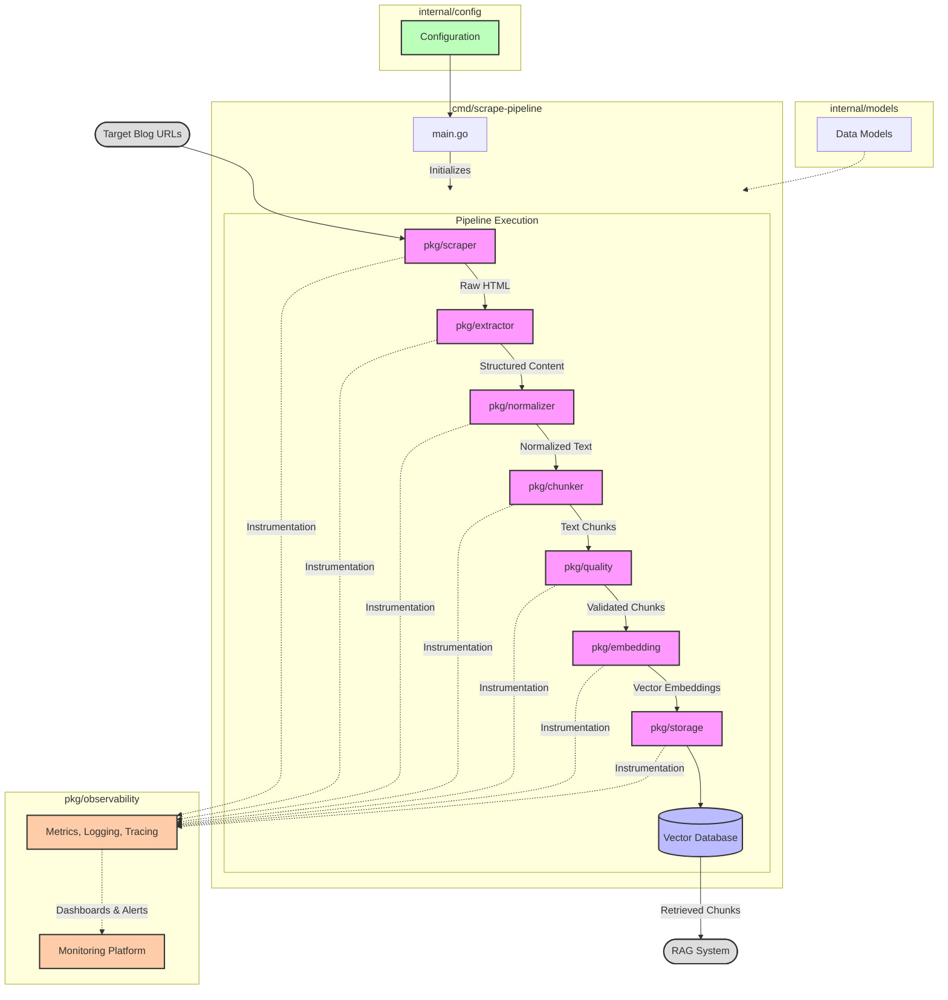

# Web Scraping and RAG System Project

## Project Overview

This project implements a robust and scalable pipeline for web scraping blog content, processing the extracted data, and preparing it for use in a Retrieval-Augmented Generation (RAG) system. The system is designed with modularity in mind, allowing components to be swapped or upgraded as needed.

## Project Structure

The project follows standard Go project layout with a focus on modularity and clear separation of concerns:

```
├── bin/                # Compiled binaries
├── cmd/                # Application entry points
│   └── scrape-pipeline/  # Main application
├── docs/               # Documentation
│   ├── index.md        # This document
│   ├── PRD.md          # Product Requirements Document
│   └── research/       # Research notes and findings
├── internal/           # Private application code
│   ├── config/         # Configuration handling
│   ├── extractor/      # Content extraction implementation
│   ├── models/         # Internal data models
│   └── scraper/        # Web scraping implementation
├── pkg/                # Public libraries that can be used by external applications
│   ├── chunker/        # Document chunking module
│   ├── embedding/      # Embedding service module
│   ├── extractor/      # Content extraction module
│   ├── normalizer/     # Text normalization module
│   ├── observability/  # Metrics, logging, and tracing
│   ├── quality/        # Quality control module
│   ├── scraper/        # Web scraping module
│   └── storage/        # Vector storage module
├── .gitignore          # Git ignore file
├── .golangci.yml       # Golangci-lint configuration
├── config.yaml         # Application configuration
├── config.yaml.example # Example configuration
├── go.mod              # Go module definition
├── go.sum              # Go module checksums
├── LICENSE             # Project license
├── Makefile            # Build and development tasks
└── README.md           # Project overview and instructions
```

## Architecture Diagram

The following diagram illustrates how the various components of the system interact:



## Module Descriptions

### Command Layer (cmd/)
Contains the application entry points and CLI implementations. The main application is in `cmd/scrape-pipeline/`.

### Internal Code (internal/)
Private application code that's not intended to be imported by other projects:
- `config/`: Configuration loading and validation
- `extractor/`: Internal content extraction logic
- `models/`: Data models and structures used within the application
- `scraper/`: Internal web scraping implementation

### Public Libraries (pkg/)
Reusable components that can be imported by other projects:
- `scraper/`: Web scraping module for discovering and crawling blog URLs
- `extractor/`: Content extraction module to separate main content from boilerplate
- `normalizer/`: Text normalization module for standardizing text formatting
- `chunker/`: Document chunking module to split content into appropriate chunks
- `quality/`: Quality control module for filtering low-quality content
- `embedding/`: Embedding service module for converting text to vector embeddings
- `storage/`: Vector storage module for storing and retrieving embeddings
- `observability/`: Observability module for metrics, logging, and tracing

### Documentation (docs/)
Project documentation including:
- `PRD.md`: Product Requirements Document
- `research/`: Research findings and background information

### Configuration
The application configuration is stored in `config.yaml` with an example provided in `config.yaml.example`.

### Build System
A `Makefile` is provided for common development tasks such as building, testing, and linting.

## Getting Started

Please refer to the `README.md` file for instructions on:
- Setting up the development environment
- Building and running the application
- Contributing to the project

For a detailed understanding of the project requirements, see the [Product Requirements Document](PRD.md). 